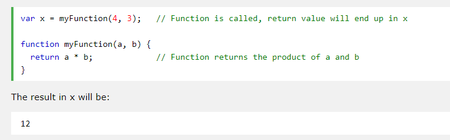

# HTML
## Links
+ HTML links are hyperlinks.
+ You can click on a link and jump to another document.
+ When you move the mouse over a link, the mouse arrow will turn into a little hand.

*Links are created using the < a> element. Users can click on anything between the opening < a> tag and the closing </a> tag. You specify which page you want to link to using the href attribute.*
Syntax:

**Linking to Other Sites**
Links are created using the < a> element which has an attribute called href.
The value of the href attribute is the page that you want people to go to when
they click on the link.

examplearts
    index.html
 images
    logo.gif
 movies
   cinema
     index.html
     listings.html
     reviews.html
  dvd
     index.html
     reviews.html
     index.html
music
     index.html
     listings.html
     reviews.html
theater
     index.html
     listings.html
     reviews.html
### Links types:
1. Same folder: reviews.html
2. Child folder:music/listings.html
3. Grandchild Folder: movies/dvd/reviews.html
4. Parent Folder: ../index.html
5. GrandParent Folder: ../../index.html

### Email Links
< a href="mailto:nada997fraihat@gmail.com>mail me < /a>

### target
you want a link to open in a new window, you can use the target attribute on the opening < a> tag. 
The value of this attribute should be _blank.

### Linking to a Sp ecific part of the Sa me Page
* You can use the id attribute to target elements within a page that can be linked to.
  By give the element which we want to move into an id, and call it by href=#id;

# Layout
## Building Blocks
1. Blocks: start on a new line and act as the main building blocks of any layout
   **such as** headings, p, ul, ol
2. Inline: flow between surrounding text
   **such as** br, images

   ## Controlling the positions of elements
   *position tag*
   1. relative: This does not affect the position of surrounding elements
   2. absoulte: which make a new layer in the web browser 
   3. Fixed: Such as the navbar, it has it's own layer
   4. Floating: allows you to take that element out of normal flow and position it to the far left or right    of a containing box.
   5. static

   ## Overlapping Elements
   by using *z-index* we can make an element above or under another one depending on it's value
   Example: z-index= -1 deeper , z-index=1 above, z-index=0  normal layer.
   
   ## Floating Elements
    The float property allows you to take an element in normal flow and place it as far to the left or right of the containing element as possible.
    **But It has a problems** can be solved by using clear attribute for the element which has a float.

    ## Screen Sizes
    As screen sizes differ from device to another, we have to make our code flexable with each one.

    ## Screen Resolution
    *Resolution refers to the number of dots a screen shows per inch.*
    ## Page Sizes
    Designers keep pages within 960-1000 pixels wide, and indicate what the site is about within the top 600 pixels (to demonstrate its relevance without scrolling).    
    ## Fized and liquid layout
    + Pages can be fixed width or liquid (stretchy) layouts.
     depending on your application you can decide which one to use.

    
    # JS
    ## Functions, Methods, and Objects
    + We use **functions, methods, and objects** to organize their code. 
    ### FUNCTIONS & Methods
    **Function** is a series of statements that have been grouped to perform a specific task
    **< script src="js/ basic-function.js"></ script>**
    The above sentence is the way that we link our JS page with HTML page, we write it before we close body tag. 
    **syntax**
    + We have 2 ways to write a function
     1. FUNCTION DECLARATION
    function name(parameter1, parameter2, parameter3) {
    // code to be executed
    } ;
    2. FUNCTION EXPRESSION 
    var functionName = function(parameter1, parameter2,parameter3) {
            return     // code to be executed ;
               } ;
    #### How to call a function?
    The code inside the function will execute when "something" invokes (calls) the function, By write the name of myFunction(); or myFunction(parameters);
    #### What is the return?
    When JavaScript reaches a return statement, the function will stop executing.
    If the function was invoked from a statement, JavaScript will "return" to execute the code after the invoking statement.
    Functions often compute a return value. The return value is "returned" back to the *caller*:
    

    

 

    **Methods**   is the same as a function, except methods In this section are created inside (part of) an object. 
    

# Pair programming
   **benifits:**
   1. Iterative loops
   2. Code reviews
   3.  Fast feedback
   4. Error checking and linting
   *At Code Fellows, pair programing is one way we foster a collaborative environment while developing key industry skills.*

## How does pair programming work?
pair programming commonly involves two roles:
1.  **The Driver:** is the programmer who is typing and the only one whose hands are on the keyboard
2.  **The Navigator:**uses their words to guide the Driver but does not provide any direct input to the        computer. 

 ## Why pair program?
 Pair programming touches on all four skills: developers explain out loud what the code should do, listen to others’ guidance, read code that others have written, and write code themselves.
 **What is the result?**
 1. Social skills
 2. It would be Greater efficiency
 3. Engaged collaboration
 4. Learning from fellow students
 5. Work environment readiness
 6. Job interview readiness

