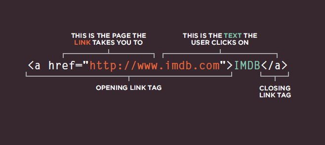
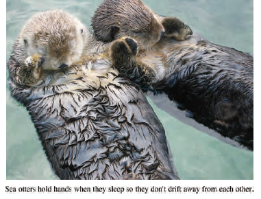
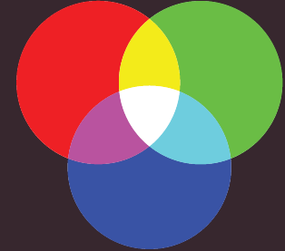
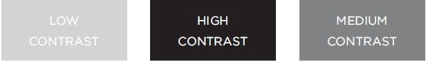
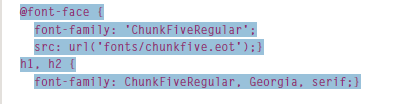
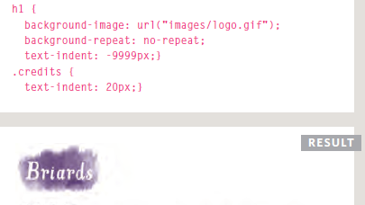
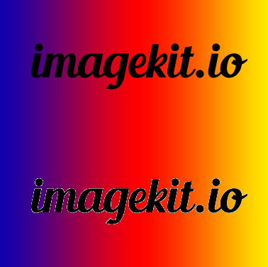

### Three rules to create an image!
     1. save the image in the right **FORMAT**.
     2. save the image with the right **SIZE**.
     3. use the correct **RESOLUTION**.
### Tools to edit images
      *There are several tools you can use to edit and save images to ensure that they are theright size,*
      *format, and resolution.*
       Such **Adobe Photoshop**
   
## Image Formats: GIF
     *Use GIF or PNG format when saving images with few colors or large areas of the same color.*
     
  
### Cropping Images: 
      *When cropping images it is important not to lose valuable information. It is best to source*
      *images that are the correct shape if possible.*
### Animated GIFs:
      *Animated GIFs show several frames of an image in sequence and therefore can be used to* 
       *create simple animations.*
   
### Transparency:
      *Creating an image that is partially transparent (or "see-through") for the web involves*
       *selecting one of two formats:*
        1. Transparent GIF
        2. PNG
  
### HTML5: Figure and Figure Caption
#### < figure>
     HTML5 has introduced a new < figure> element to contain images and their caption so that the two are 
     associated.
     
   
      

## Color and Background-color
 *Color can really bring your pages to life.*

 You can specify any color *blue* in CSS in one of three ways:
  1. rgb values
  2. hex codes
  3. color names
### How my screen display a color?

  *Computer monitors are made up of thousands of tiny squares called pixels (if you look very closely 
  at your monitor you should be able to see them).*
  
 
### Contrast
   It's important to ensure that there is enough contrast between background color and the content's color.
     
### HSL vs HSLA
     **HSL:** hsl( hue,saturation,lightness,alpha)
     *Where is:*
     + hue takes a values from 0 and 360 degrees
     + saturation expressed as %
     + lightness expressed by % too, while 0% display white, 50% Normal, 100% black.
     + Alpha expressed as a number between 0 and 1.0.
  
## Text
   The properties that allow you to control the appearance of text can be split into two groups:
   1. Those directly affect the font and its appearance **such:**
      + typeface
      + size of the text
   2. Those that would have the same effect on text no matter what font you were using **such:**
      + color
      + spacing between words
### Typeface Terminology:
There are some of attributes that can be used for the text:
   1. font-family
   2. font-weight: bold/light/500..
   3. font-style: italic/oblique..
   4. font-stretch
   5. font-face
   6. text-transform: uppercase/lowercase/capitalize/..
   7. text-decoration: none/ underline/..
#### font-size/ Type Scales
     1. Pixels
     2. Percentage
     3. em
     **each 16px= 1 rem = 100%**
#### @font-face
*As your window does not have a specific font the you want, you can download it and call it in CSS by @font-face*
    
**KEEP in mind** Different browsers support different formats for font, so you will need to supply the font in several variations to reach all browsers.

#### letter-spacing, word-spacing
1. **letter-spacing**: make a space between letters of each word

2. **word-spacing:** make a space between rach word in the paragraph

#### vertical-align
It is not intended to allow you to vertically align text in the middle of block level elements such as < p> and < div>, although it does have this 
effect when used with table cells (the <td> and <th> elements).
*It is more commonly used with inline elements such as , <em>, or <strong> elements.*

#### text-indent
The text-indent property allows you to indent the first line of text within an element.
  

### First Lett er or Line
*Technically these are not properties. They are known as pseudo-elements.*

It is **worth** trying this example in your browser it only affect the first line of text, even if you resize your browser window and less or
more words appear on each line.
### Styling Links
1. a:link
*This allows you to set styles for links that have not yet been visited.*
2. a::visited
*This allows you to set styles for links that have been clicked on.*

Also we have :focus, :hover, :active styling

## JPEG vs PNG vs GIF
Type  | when we use it
------|---------------
JPEG  |Images with **smooth** variation and intensity, such natural scene. 
PNG   |Images that needs transparency or for images with sharp contrast content, such logo.
GIF   |Images that contain animations.

### How to get a compression image, video..etc?
Compression can be of two types:
1. **lossless** it is possible to **reconstruct** the original image from the compressed image because there is **no information loss** during compression
2. **lossy ** data loss in lossy compression is irreversible.

Type  | Compression type
------|---------------
JPEG  |Loosy
PNG   |Lossless 
GIF   |Lossless 

### Transparency

Type  | Transparency
------|---------------
JPEG  |don’t support transparency
PNG   |support transparency 
GIF   |support transparency
**But there is a diiference between PNG ans GIF here, as the following figure:**
 

### Colours

Type  | Colors
------|---------------
JPEG  |can support around 16 million colours, that is why it's good for natural sence.
PNG   |Have two modes — PNG8(support upto 256 colours)  and PNG24( can handle upto 16 million)
GIF   |limited to 256 colours

### Animation
Type  | Animation
------|---------------
JPEG  | can not support
PNG   | can not support
GIF   | can support it

